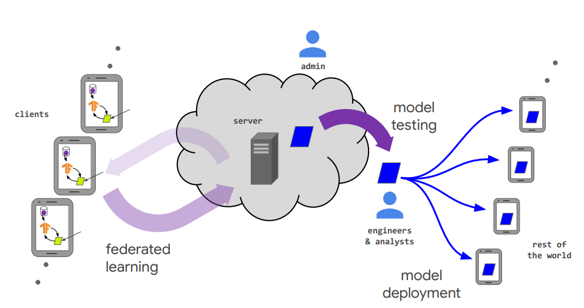
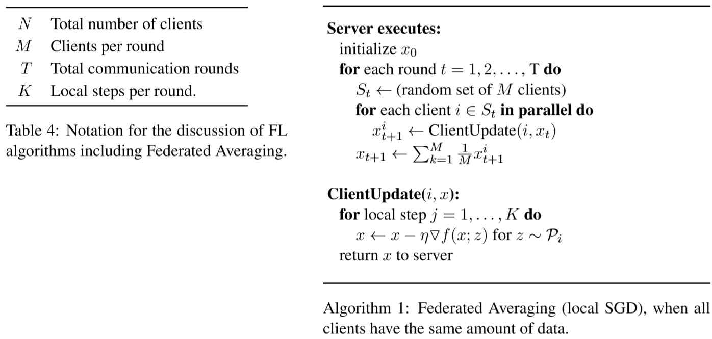
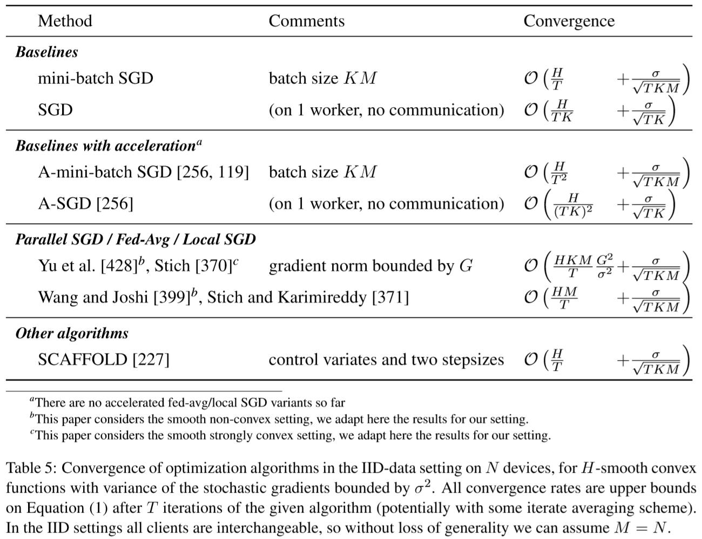
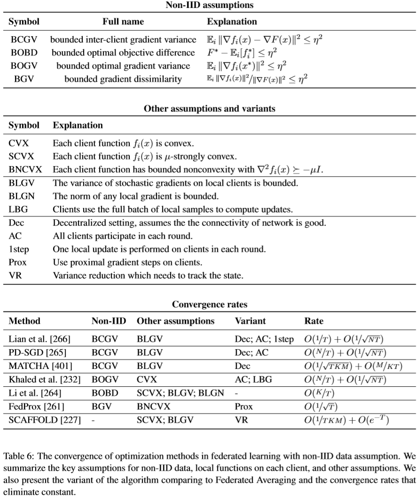

本文根据论文Advances and Open Problems in Federated Learning整理， 感谢@open-intelligence https://github.com/open-intelligence/federated-learning-chinese 的翻译工作， 本文将持续更新。。。

# 联邦学习FAQ

1. 什么是联邦学习？

   联邦学习（FL）是一种机器学习设定，其中许多客户端（例如，移动设备或整个组织）在中央服务器（例如，服务提供商）的协调下**共同训练模型**，同时保持训练数据的**去中心化及分散性**。

2. 为什么叫“联邦”学习？有什么特点？

   因为学习任务是通过由中央服务器协调的参与设备（客户端）的松散联邦来解决的。**不均衡和非IID**（独立同分布）的数据分隔通过大量**不可靠的设备**，并且是**有限的通信带宽**，这是作为引入的挑战。

3. 为什么要引入“联邦学习”这个概念？

   大量工作试图使用中央服务器在**保护隐私的同时从本地数据中学习**。目前没有任何一项工作可以直接解决FL定义下的全部挑战。“联邦学习”这个词为这一系列特征，约束和挑战**提供了便捷的简写**，这些约束和挑战通常在隐私至关重要的机器学习问题中同时出现。

4. 联邦学习的场景与分类？

   联邦学习根据不同场景可以分为两大类：“**跨设备**”和“**跨孤岛**”。

   跨设备：Google在Gboard移动键盘

   跨孤岛：医疗数据联邦

5. 联邦学习的生命周期？

   1. **问题识别：** 模型工程师识别确立一个需要在FL中解决的问题。
   2. **客户工具：** 如果需要，可以对客户端（例如，在手机上运行的应用程序）进行工具化，以在本地（时间和数量上受限制）存储必要的训练数据。在许多情况下，该应用程序已经存储了这些数据（例如，短信应用程序必须存储文本消息，照片管理应用程序已经存储了照片）。但是，在某些情况下，可能需要维护其他数据或元数据，例如用户交互数据，为监督学习任务提供标签。
   3. **仿真原型：**模型工程师可以使用代理数据集在FL模拟中对模型体系结构进行原型设计并测试学习超参数。
   4. **联邦模型训练：** 开始执行多个联邦训练任务以训练模型的不同变体，或使用不同的优化超参数。
   5. **（联邦）模型评估：** 在对任务进行了足够的训练之后（通常是几天），将对模型进行分析并选择好的候选。分析可能包括在数据中心的标准数据集上计算的度量矩阵，或者是联邦评估，其中，将模型推送给受约束的客户，以评估本地客户数据。
   6. **部署方式：** 最后，一旦选择了一个好的模型，就会通过标准的模型启动过程，包括手动的质量审查，实时A / B测试（通常通过在某些设备上使用新模型以及在其他设备上使用上一代模型来比较其内在性能）。

   

6. 联邦学习和一般分布式机器学习的主要区别？

   |          | **分布式训练**                                   | **联邦学习**                                    |
   | -------- | ------------------------------------------------ | ----------------------------------------------- |
   | 数据分布 | 集中存储，但可以任意打乱、平衡地分配给所有客户端 | 分布式存储，数据无法互通、可能存在数据的Non-IID |
   | 节点数量 | 1~1000                                           | 1~10^10                                         |
   | 节点状态 | 所有节点稳定运行                                 | 节点可能不在线                                  |

7. 联邦学习和完全去中心化学习的主要区别？

   |          | 联邦学习                                                     | 完全去中心化（点对点）学习 |
   | -------- | ------------------------------------------------------------ | -------------------------- |
   | 编排方式 | 中央编排流程服务器或服务负责组织训练，但从未看到原始数据。   | 没有集中的编排流程。       |
   | 宽域通信 | 中心辐射型拓扑，中心代表协调服务提供商（通常不包含数据），分支连接到客户端。 | 对等拓扑，带有动态连接图。 |

8. 跨数据和跨孤岛的主要区别？

   |          | 分布式训练                                       | **联邦学习**                                    |
   | -------- | ------------------------------------------------ | ----------------------------------------------- |
   | 数据分布 | 集中存储，但可以任意打乱、平衡地分配给所有客户端 | 分布式存储，数据无法互通、可能存在数据的Non-IID |
   | 节点数量 | 1~1000                                           | 1~10^10                                         |
   | 节点状态 | 所有节点稳定运行                                 | 节点可能不在线                                  |

9. 移动设备上典型联邦学习应用程序中涉及的数量的典型数量级大小？

| 总样本大小                 | 10^6--10^10个设备 |
| -------------------------- | ----------------- |
| 一轮训练的设备选择数       | 50--5000          |
| 参与一个模型训练的总设备数 | 10^5--10^7        |
| 模型收敛的总轮数           | 5000--10000       |
| 训练时间                   | 1--10天           |

10. 该几种不同设定的综合对比？

    |              | 数据集中式的分布式学习                                       | 跨孤岛的联邦学习                                             | 跨设备的联邦学习                                             |
    | ------------ | ------------------------------------------------------------ | ------------------------------------------------------------ | ------------------------------------------------------------ |
    | 设置         | 在大型但“扁平”的数据集上训练模型。客户端是单个群集或数据中心中的计算节点。 | 在数据孤岛上训练模型。客户是不同的组织（例如，医疗或金融）或地理分布的数据中心。 | 客户端是大量的移动或物联网设备                               |
    | 数据分布     | 数据被集中存储，可以在客户端之间进行混洗和平衡。任何客户端都可以读取数据集的任何部分。 | 数据在本地生成，并保持分散化。每个客户端都存储自己的数据，无法读取其他客户端的数据。数据不是独立或相同分布的。 | 与跨数据孤岛的数据分布一样                                   |
    | 编排方式     | 中央式编排                                                   | 中央编排服务器/服务负责组织培训，但从未看到原始数据。        | 与跨数据孤岛编排方式一样                                     |
    | 广域通讯     | 无（在一个数据中心/群集中完全连接客户端）。                  | 中心辐射型拓扑，中心代表协调服务提供商（通常不包含数据），分支连接到客户端。 | 与跨数据孤岛的广域通讯方式一样                               |
    | 数据可用性   | 所有客户端都是可用的                                         | 所有客户端都是可用的                                         | 在任何时候，只有一小部分客户可用，通常会有日间或其他变化。   |
    | 数据分布范围 | 通常1-1000个客户端                                           | 通常2-1000个客户端                                           | 大规模并行，最多10^10个客户端。                              |
    | 主要瓶颈     | 在可以假设网络非常快的情况下，计算通常是数据中心的瓶颈。     | 可能是计算和通信量                                           | 通信通常是主要的 瓶颈，尽管这取决于任务。通常，跨设备联合计算使用wi-fi或更慢的连接。 |
    | 可解决性     | 每个客户端都有一个标识或名称，该标识或名称允许系统专门访问它。 | 与数据集中式的分布式学习一样                                 | 无法直接为客户建立索引（即不对用户进行标记）。               |
    | 客户状态     | 有状态的-每个客户都可以参与到计算的每一轮中，不断地传递状态。 | 有状态的-每个客户都可以参与到计算的每一轮中，不断地传递状态。 | 高度不可靠-预计有5％或更多的客户端参与一轮计算会失败或退出（例如，由于违反了电池，网络或闲置的要求而导致设备无法使用）。 |
    | 客户可靠性   | 相对较少的失败次数                                           | 相对较少的失败次数。                                         | 无状态的-每个客户在一个任务中可能只参与一次，因此通常假定在每轮计算中都有一个从未见过的客户的新样本。 |
    | 数据分区轴   | 数据可以在客户端之间任意分区/重新分区。                      | 固定分区。能够根据样本分区（横向）或者特征分区（纵向）。     | 根据样本固定分区（横向）。                                   |

11. 联邦学习里有哪些主要研究问题？

    提高效率和有效性、隐私保护、非独立同分布数据、通信安全和效率

12. 什么是Non-IID非独立同分布数据？

    非独立同分布主要有三个方面：

    - **不同客户端数据分布不同**
      - 特征分布倾斜：P(x)不同；不同人的笔迹不同
      - 标签分布倾斜：P(y)不同；企鹅在南极、北极熊在北极
      - 标签相同特征不同：P(x|y)不同；概念飘移
      - 特征相同标签不同：P(y|x)不同；点头表示yes / no?
      - 数量不平衡
    - **数据偏移**：训练集测试集不同分布
    - **非独立**：可用节点大多在附近的时区

13. 处理Non-IID数据有什么策略？

    修改现有的算法、创建一个可以全局共享的小数据集、不同客户端提供不同的模型

14. 联邦学习有什么优化算法？

    联邦平均算法（FedAvg）

    

15. FedAvg算法的流程？

    1. **客户端选择：**服务器从一组符合资格要求的客户端中采样。例如，为避免影响设备用户，移动电话可能仅在未计量的wi-fi连接上插入且处于空闲状态时才签入服务器。
    2. **传播：** 选定的客户端从服务器下载当前模型权重和训练程序。
    3. **客户端计算：** 每个选定的设备都通过执行训练程序在本地计算对模型的更新，例如，可以在本地数据上运行SGD。
    4. **聚合：** 服务器收集设备更新的汇总。为了提高效率，一旦有足够数量的设备报告了结果，用户就可以在此处放散手。此阶段也是许多其他技术的集成点，这些技术将在后面讨论，可能包括：用于增加隐私的安全聚合，为了通信效率而对聚合进行有损压缩，以及针对差分隐私的噪声添加和更新限幅。
    5. **模型选择：** 服务器根据从参与当前轮次的客户端计算出的聚合更新在本地更新共享模型。

16. 联邦学习不同优化算法的收敛率如何？

    

17. 联邦学习中优化算法的理论假设？

    

18. 联邦学习可能遇到什么样的安全威胁？

    | **数据/访问节点** | **参与者**                                           | **威胁模型**                                                 |
    | ----------------- | ---------------------------------------------------- | ------------------------------------------------------------ |
    | 客户端            | 通过系统设计或破坏设备获得客户端设备的最高访问权限者 | 恶意客户端可以检查所参与轮次从服务器接收的全部消息（包括模型迭代），并可以篡改训练过程。老实但好奇的客户端可以检查从服务器接收的所有消息，但不能篡改培训过程。在某些情况下，安全包围/TEEs等技术可能会限制此类攻击者的影响和信息可见性，从而削弱该模型威胁程度。 |
    | 服务器            | 通过系统设计或破坏设备获得服务器设备的最高访问权限者 | 恶意服务器可以检查所有轮次发送到服务器的全部消息（包括梯度更新），并可以篡改训练过程。老实但好奇的客户端可以检查发送到服务器的所有消息，但不能篡改培训过程。在某些情况下，安全包围/TEEs等技术可能会限制此类攻击者的影响和信息可见性，从而削弱该模型威胁程度。 |
    | 输出模型          | 工程师与分析师                                       | 恶意分析师或模型工程师可以访问系统的多组输出，例如，使用不同超参数的多个训练运行的模型迭代序列。该向这类参与者发布什么信息是一个重要的系统设计问题。 |
    | 部署模型          | 其他设备                                             | 在跨设备联邦学习场景下，最终模型可能部署到数亿个设备上。访问部分受损的设备可能仍满足黑盒模型，而访问完全受损的设备可以认为是白盒模型。 |

    

19. 联邦学习环境下的攻击者有哪些特征？

    |  **特征**  |                           **描述**                           |
    | :--------: | :----------------------------------------------------------: |
    |  攻击向量  | 敌人发起攻击的方式  l *数据中毒*： 敌人修改用来训练的用户数据集  l *模型更新中毒*：敌人更新发送回服务器的模型更新数据  l *回避攻击*：对手改变推断阶段使用的数据 |
    |  模型检查  | 敌人是否能够观察到模型参数  l *黑箱*：对手在攻击前和攻击时都没有能力观测到模型参数。在联邦学习环境中一般不是这种情况  l *陈旧白箱*：对手只能观测到一个陈旧的模型。当对手可以接触到参加中间训练回合的客户时，这自然会在联邦环境中出现。  l *白箱*：对手有能力直接观测到模型参数 |
    | 参与者串通 | 多个敌人是否可以协同发起攻击  l *无串通*：参与者无法通过串通发起攻击  l *Cross-update**串通*：过去的客户端参与者可与未来的参与者协同攻击全局模型在未来的更新  l *Wthin-update**串通*：当前客户端参与者可协同发起对模型当前更新的攻击 |
    |   参与率   | 在训练期间敌人能多久发动一次攻击  l 在跨设备联邦环境中，一个恶意用户可能只能参与一个模型训练回合  l 在跨竖井联邦环境中，一个敌人可能能持续参与模型的学习过程 |
    |   适应性   | 敌人是否能在攻击过程中修改攻击参数  l *静态*：敌人必须在攻击之初确定攻击参数且无法在发起攻击后更改。  l *动态*：敌人能够在模型训练过程中修改攻击 |

20. 联邦学习有哪些工具和平台？

    + TensorFlow Federated [38]专门针对研究用例，提供大规模模拟功能以及灵活的编排来控制采样。  
    + PySyft 是用于安全的私有深度学习Python库。 PySyft使用PyTorch中的联邦学习，差分隐私和多方计算（MPC）将私人数据与模型训练分离。  
    + Leaf 提供了多个数据集以及模拟和评估功能。 
    + FATE（Federated AI Technology Enabler）是一个开源项目，旨在提供安全的计算框架来支持联邦AI生态系统。   
    + PaddleFL 是基于PaddlePaddle 的开源联邦学习框架。在PaddleFL中，通过应用程序演示提供了几种联邦学习策略和训练策略。  
    + Clara培训框架包括基于服务器客户端方法和数据隐私保护的跨孤岛联邦学习的支持 

21. 联邦学习有什么数据集？

    + EMNIST数据集由671,585个数字图像和大小写英文字符（62个类）组成。 联邦版本将数据集拆分为3,400个不平衡客户端，这些客户端由数字/字符的原始编写者索引。 非IID分布来自每个人独特的写作风格。
    + Stackoverflow数据集由来自Stack Overflow的问答组成，并带有时间戳，分数等元数据。训练数据集拥有342,477多个唯一用户和135,818,730个示例。请注意，时间戳信息可能有助于模拟传入数据的模式。
    + Shakespeare是从The Complete Works of William Shakespeare获得的语言建模数据集。 它由715个字符组成，其连续行是客户端数据集中的示例。训练集有16,068个示例，测试集有2,356个示例。

    - Leafproject 提供了对EMNIST和Shakespeare的预处理，它还提供了sentiment140和celebA数据集的联邦版本。这些数据集具有足够的客户端，可以用于模拟跨设备FL场景，但是对于规模特别重要的问题，它们可能太小。在这方面，Stackoverflow提供了跨设备FL问题的最现实示例。 
    - NICO

22. 

    

    
